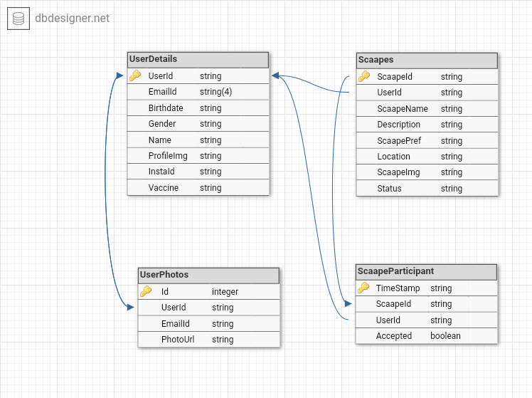
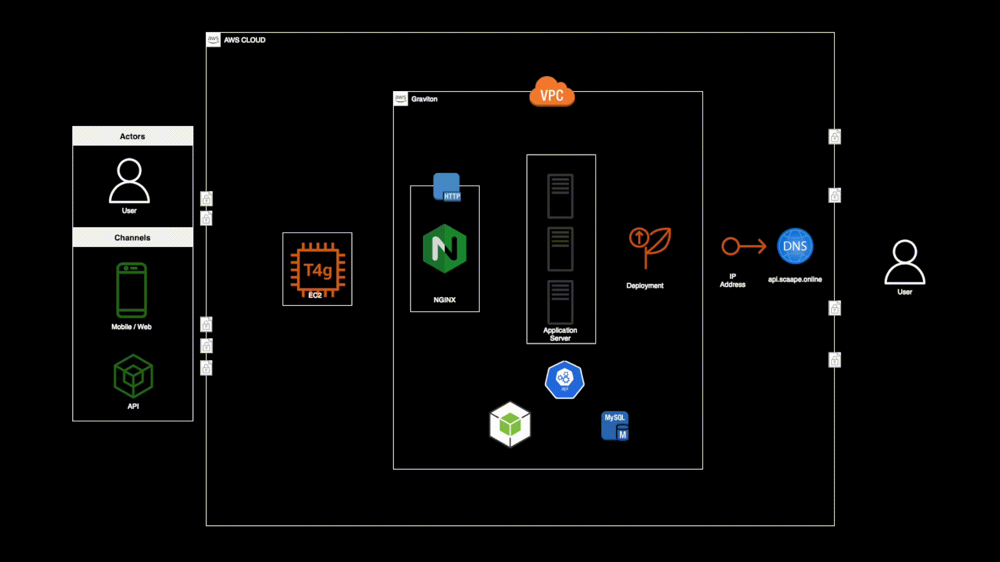
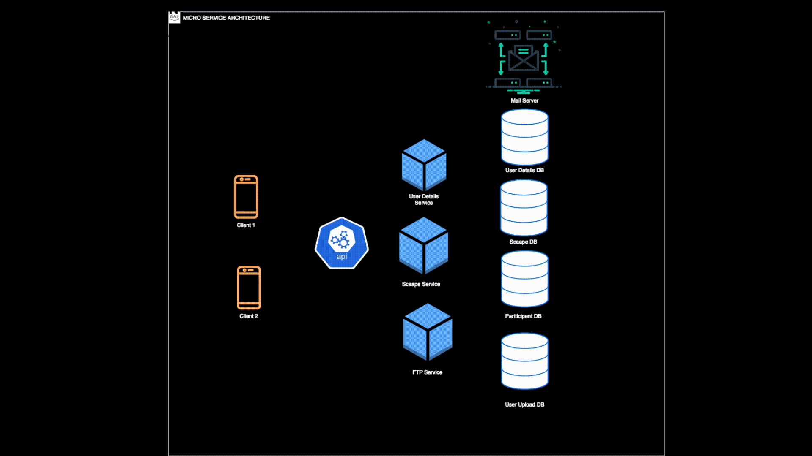

<h1>Backend of <a href="https://github.com/Scaape/Scaape-flutter-FE">SCAAPE</a></h1>
<h2>Database Design</h2>
</img>
<h2>Architecture</h2>

<h1>License</h1>
Licensed under the <a href="https://github.com/Scaape/Scaape_node_BE/blob/readme/LICENSE">MIT License</a>.
